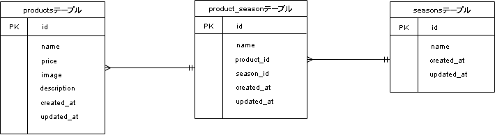

# check-test2

## 環境構築
Dockerビルド：
    docker-compose up -d —build

Laravel環境開発：
    1. docker-compose exec php bash
    2. composer create-project "laravel/laravel=8.*" . --prefer-dist
    3. .envに以下の環境変数を追加
        DB_CONNECTION=mysql
        DB_HOST=mysql
        DB_PORT=3306
        DB_DATABASE=laravel_db
        DB_USERNAME=laravel_user
        DB_PASSWORD=laravel_pass
    4. php artisan key:generate
    5. php artisan migrate
    6. php artisan db:seed
  

## 使用技術
- PHP 7.4.9
- Laravel 8.83.27
- MySQL 8.0.26

## ER図
- 

## URL
- 開発環境：http://localhost
- phpMyAdmin：http://localhost:8080/